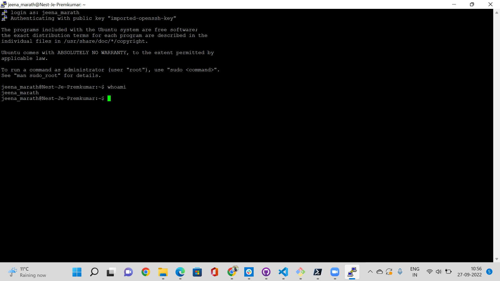

# Linux Setup
Linux machine is a virtual machine which is accessed using the SSH connection. The key and authetication details were given and we accessed the VM using the putty client.
## Key Terminologies
* SSH key which was a pem file which had to converted to pk file using the putty key generator
* Power shell was installed and was used to Open the SSH.

## Exercise
Make a connection to the VM using SSH and show the user who is logged in.

### Sources

* [Open SSH](https://learn.microsoft.com/en-us/windows-server/administration/openssh/openssh_install_firstuse?tabs=powershell)

### Overcome challenges
 Initally used the pem file as the key and it wasnt authenicating to open the SSH.Converted the key to ppk and it worked.

 ### Results
 

