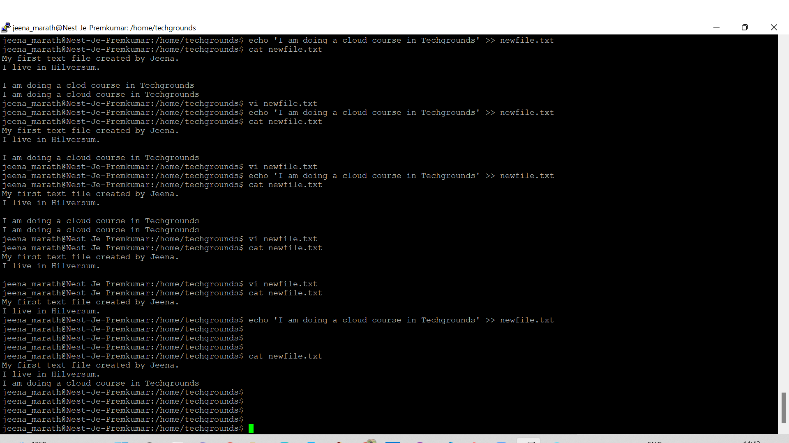
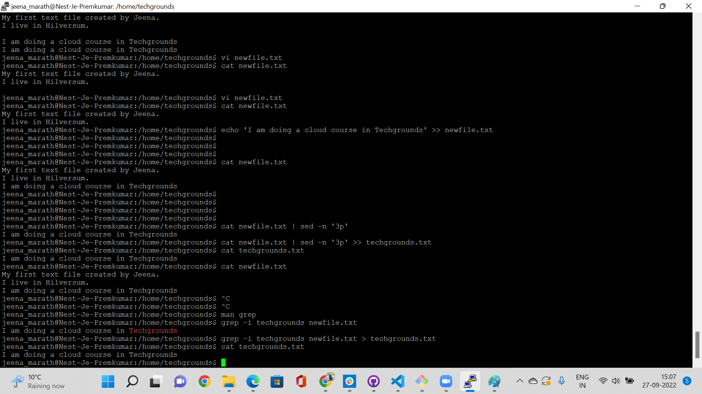

# Working with text CLI
Trying to add content to file, search for words in the file , move the line to new file.
## Key Terminologies
* echo - used to display contect of file, or something on the screen or add more line to a file.
* sed - used to navigate to a particular line in a file and print it.It can be used to delete a particular line in a file.
* grep - is a powerful command to search for a pattern of characters display those lines containing it.
* awk  - can be used go to a particular line in a file 

## Exercise
- Use the echo command and output redirection to write a new sentence into your text file using the command line. The new sentence should contain the word ‘techgrounds’.
- Use a command to write the contents of your text file to the terminal. Make use of a command to filter the output so that only the sentence containing ‘techgrounds’ appears.
- Read your text file with the command used in the second step, once again filtering for the word ‘techgrounds’. This time, redirect the output to a new file called ‘techgrounds.txt’.

### Sources

* [Echo](https://phoenixnap.com/kb/echo-command-linux#displaying-command-outputs)
* [sed](https://www.linuxshelltips.com/print-particular-line-file-linux/)
* [grep](https://www.geeksforgeeks.org/grep-command-in-unixlinux/)
* [DeleteLine](https://www.baeldung.com/linux/delete-lines-containing-string-from-file)

### Overcome challenges
 No challenges faced. Learned from peer more ways to do the same exercise.

 ### Results
 

