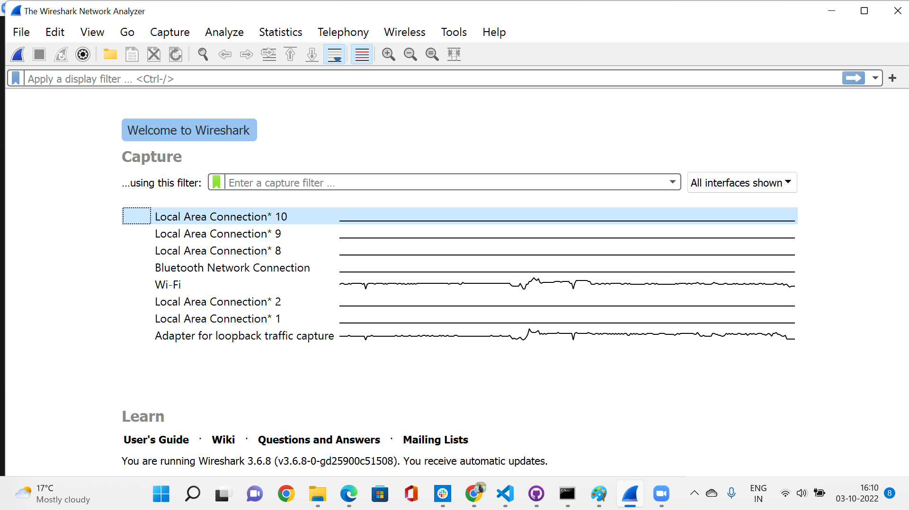
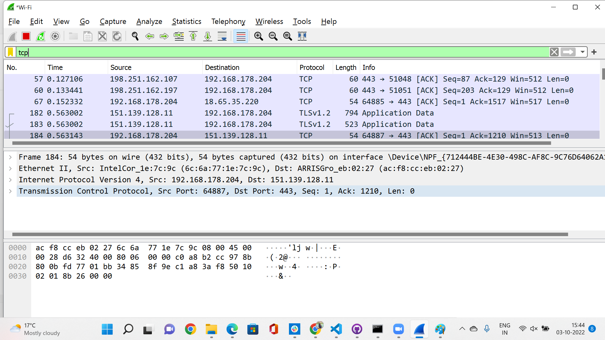
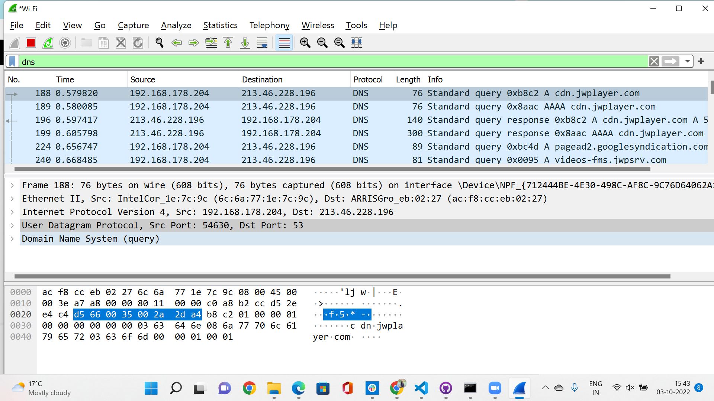

# Protocols
A network protocol is an agreement about how to communicate. There are protocols on every layer of the OSI stack.

## Key Terminologies
* Protocol -A network protocol is an accepted set of rules that govern data communication between different devices in the network
* Wireshark - It is an open-source packet analyzer, which is used for education, analysis, software development, communication protocol development, and network troubleshooting

## Exercise 1
- Identify several other protocols and their associated OSI layer. Name at least one for each layer.
- Figure out who determines what protocols we use and what is needed to introduce your own protocol.
- Look into wireshark and install this program. Try and capture a bit of your own network data. Search for a protocol you know and try to understand how it functions.

### Sources

* [Protocols](http://www.vidyagyaan.com/computer-knowledge/the-seven-layers-of-osi-model-their-protocols-and-functions/)
* [Protocols](https://www.guru99.com/layers-of-osi-model.html)
* [Protocols Defined](https://www.comptia.org/content/guides/what-is-a-network-protocol#:~:text=The%20following%20groups%20have%20defined%20and%20published%20different,Union%20%28ITU%29%20The%20World%20Wide%20Web%20Consortium%20%28W3C%29)

* [Custom protocols](https://softwareengineering.stackexchange.com/questions/366134/can-someone-implement-a-custom-network-protocol)

*[QUIC](https://en.wikipedia.org/wiki/QUIC)

* [Wireshark ](https://wiki.wireshark.org/CaptureFilters)

* [Wireshark download](https://www.wireshark.org/)

### Overcome challenges
 
The second question wasnt very clear and we were looking for more solutions on the same, but after the scrum meeting was able to conclude that what we have understood the question correctly and the answer was the same.

 ### Results

#### Question 1

Layer 7	Application	-SMTP, HTTP, FTP, POP3, SNMP,DHCP,Telnet,ICMP,DNS

Layer 6	Presentation-	MPEG, ASCH, SSL, TLS

Layer 5	Session	-NetBIOS, SAP,SMPP

Layer 4	Transport -	TCP, UDP

Layer 3	Network	- IPV5, IPV6, ICMP, IPSEC, ARP, MPLS.

Layer 2	Data Link -	RAPA, PPP, Frame Relay, ATM, Fiber Cable, etc.

Layer 1	Physical -	RS232, 100BaseTX, ISDN, 11.

#### Question 2

Network protocols are typically created according to industry standard by various networking or information technology organizations.

The following groups have defined and published different network protocols:

- The Institute of Electrical and Electronics Engineers (IEEE)
- The Internet Engineering Task Force (IETF)
- The International Organization for Standardization (ISO)
- The International Telecommunications Union (ITU)
- The World Wide Web Consortium (W3C)

If we have to create a new protocol , it has be created in line with the existing protocols so that it works along with the existing protocol. The new protocols Internet Draft with the specification has to be submitted to any of the organizations that standardizes the protocol like IETF. The organization will review it and decide.Once its approved , it will be made as a worldwide standard. One such example is QUIC.

#### Question 3

Wireshark capture of the network data

Wireshark capture of TCP 

Wireshark capture of DNS 

