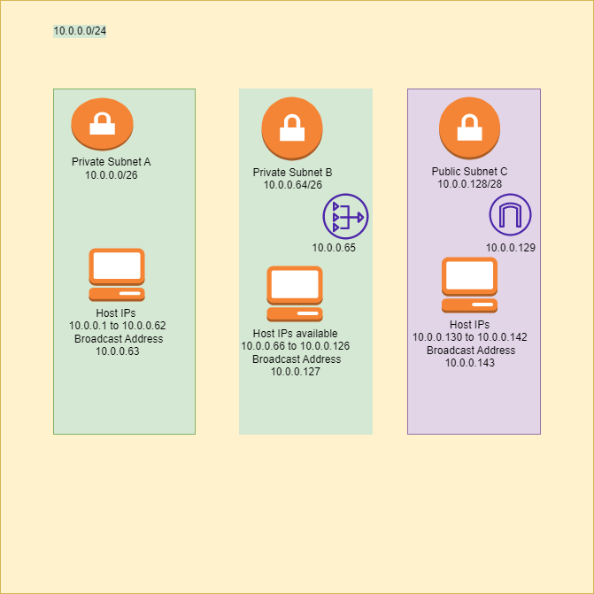

# Subnetting
A subnet, or subnetwork, is a network inside a network. Subnets make networks more efficient. Through subnetting, network traffic can travel a shorter distance without passing through unnecessary routers to reach its destination.

## Key Terminologies
* Subnet mask -A subnet mask is like an IP address, but for only internal usage within a network.

## Exercise 
- Create a network architecture that meets the following requirements:
1 private subnet accessible only from within the LAN. This subnet must be able to accommodate a minimum of 15 hosts.
1 private subnet that has Internet access through a NAT gateway. This subnet must be able to accommodate a minimum of 30 hosts (the 30 hosts does not include the NAT gateway).
1 public subnet with an internet gateway. This subnet must be able to accommodate a minimum of 5 hosts (the 5 hosts does not include the internet gateway).
- Post the architecture you created including a brief explanation in the Github repository you shared with the learning coach.

### Sources

* [Subnetting 1](https://subnettingpractice.com/how-to-subnet.html)
* [Subnetting video link](https://www.youtube.com/watch?v=BWZ-MHIhqjM&t=0s)
* [Subnetting 2](https://www.cloudflare.com/learning/network-layer/what-is-a-subnet/)

* [Subnet calculator](https://networkcalc.com/subnet-calculator/10.0.0.0/26)
* [Subnet calculator](https://subnettingpractice.com/subnet-calculator.html)

* [Subnet Explained](https://portforward.com/networking/subnetting/#:~:text=The%20gateway%20can%20be%20on%20any%20ip%20address,always%20on%20the%20last%20one%20in%20the%20range.)

* [Public Subnet](https://docs.cherryservers.com/knowledge/public-ip-subnet)
* [Subnet NAT Gateway](https://medium.com/analytics-vidhya/providing-internet-connectivity-to-private-subnet-through-nat-gateway-edf6955f8cea)
* [Internet vs NAT gateway](https://www.learnaws.org/2022/06/30/internet-vs-nat-gateway/)

### Overcome challenges

 Understanding the subnetting topic and drawing the network diagram was a little challenging and took more time than expected. The diagram also had to be drawn many times as i missed to see the template given in the question.

 ### Results

