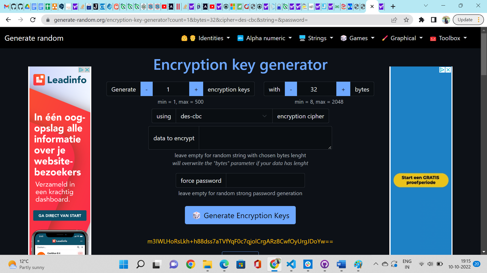
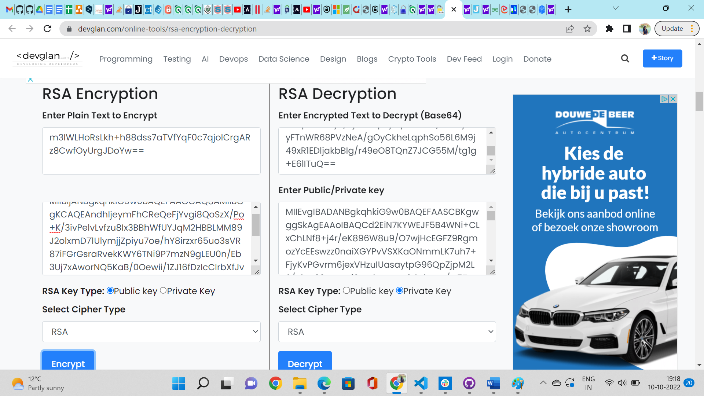
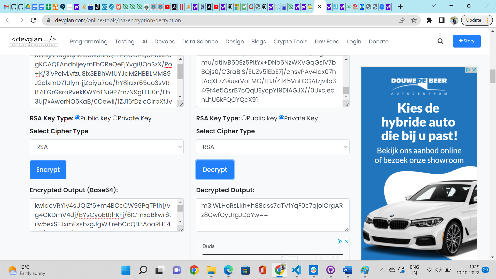
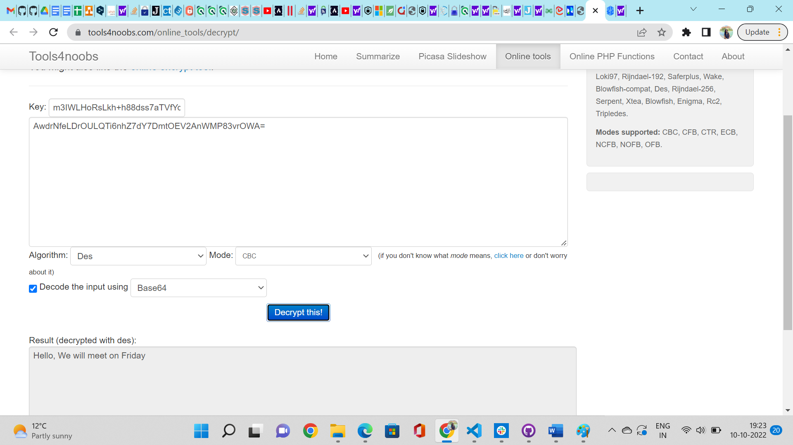

# Symmetric encryption
Encryption is an important tool for securing data. Be it data at rest, or data in motion. A lot of what you do on your computer and the Internet is encrypted.

## Key Terminologies
* Symmetric Encryption : In Symmetric encryption, the message to be protected can be encrypted and decrypted using the same key.It’s a popular encryption option, and the secret key used here can either be a mix of letters, words, or numbers 

## Exercise 

- Find two more historic ciphers besides the Caesar cipher.
- Find two digital ciphers that are being used today.
- Send a symmetrically encrypted message to one of your peers via the public Slack channel. They should be able to decrypt the message using a key you share with them. Try to think of a way to share this encryption key without revealing it to everyone. 
You are not allowed to use any private messages or other communication channels besides Slack. Analyse the shortcomings of this method.

### Sources

* [Historical Ciphers1](https://www.enkivillage.org/types-of-codes.html)
* [Historical Ciphers2 ](https://www.allassignmenthelp.com/blog/famous-codes-and-ciphers/)
* [Historical Ciphers3](https://interestingengineering.com/innovation/11-cryptographic-methods-that-marked-history-from-the-caesar-cipher-to-enigma-code-and-beyond)
* [Modern Encryption](https://www.w3schools.in/cyber-security/modern-encryption)
* [AES](https://www.cheapsslshop.com/blog/types-of-encryption)
* [ChaCha](https://www.w3schools.in/cyber-security/modern-encryption)
* [Symmetric Encrption ](https://www.clickssl.net/blog/what-is-symmetric-encryption)
* [256 Bit Encryption](https://www.clickssl.net/blog/256-bit-encryption)
* [Symmetric vs Asymmetric](https://www.clickssl.net/blog/symmetric-encryption-vs-asymmetric-encryption)
* [Symmteric Encryption 2](https://sslmagic.com/blog/symmetric-encryption-101-how-it-works-when-its-used/)
* [Eras of Ciphers ](http://practicalcryptography.com/ciphers/)
* [Symmetric Encryption](https://phemex.com/academy/what-is-symmetric-key-encryption)
* [Encryption tool](https://www.tools4noobs.com/online_tools/encrypt/)
* [Random key generator](https://generate-random.org/encryption-key-generator?count=1&bytes=32&cipher=des-cbc&string=&password=)

### Overcome challenges
  
  The exchange of key for the symmetric encryption was a little challenging to come up. We had to really deep dive and understand the concept of both symmetric and asymmetric to get it right. We were able to accomplish the task as we tried the asymmetric encryption before the symmetric encryption.

 ### Results

 #### Question 1

Enigma Code:
The Germans used this sophisticated cipher during the Second World War. It involved using an Enigma machine, which is similar to the type writer. All Germans had the same Enigma machine and the initial wheel configuration of the machine was communicated to all the teams. When a letter was pressed on the machine, a cipher letter lit up on the screen. It got even more difficult when the wheel rotated after certain number of letters, so that the cipher kept on changing. There could be over one hundred trillion possible configurations and hence was difficult to decipher Enigma.

Scytale : 
Scytale was an ancient form of encryption commonly in ancient/classical Greece. It is a form of transposition cipher where letters are re-arranged in the messages prior to being deciphered by the recipient. 
This method involved the use of a cylinder around which a parchment was wrapped and the message written onto it. The recipient would use a rod of the exact same dimensions to read the message.

#### Question 2

AES Symmetric Encryption Algorithm - 
The NIST approved AES Encryption Algorithm in 2001, and it is a prevalent algorithm in the current scenario. It comprises different lengths of keys and block sizes. The algorithm works on permutation and substitution. 

In this type of algorithm, the data is initially converted into the block, and then the encryption begins with the binding encryption key. The process includes shift rows, mix columns, sub bytes, and round keys (10,12 and 14 rounds).

- AES 256 Bit Encryption - 
    256-bit encryption is a security protocol that encrypts and decrypts the data exchanged between the browser and the server using the 256-bit encryption key.
    This is the safest digital security solution and hence all the modern algorithms, AES, as well as SSL (Secure Socket Layers), certificates use 256-bit encryption.
    The main charm of this encryption is that any intruder who does not possess a decryption key but wants to decrypt the data secured by this encryption needs to try 256 varied combinations to break the cipher code.

- XChaCha20 - It is a 256-bit stream encryption type. Like AES, it is symmetric and uses a single key to scramble and unscramble data. (Although there’s also an asymmetric version of it).
Instead of dividing data into blocks, XChaCha20 ciphers each bit of data separately. This makes the process much quicker and less complex than with AES. 

#### Question 3

For symmertric encryption the sender and receiver should have the same key to encrypt and decrypt. Here the challenge was how to safely trasfer the key to the receiver . So first we generated a sercret random key for encryption and we used asymmetric encryption to send this key to the receiver .Below the randomly generated key.

 The random secret key was encrypted using the RSA algorithm . The receivers public key was used to encrypt the secret key and was send to the receiver. The receiver then used his private key to decrypt the key. Now both the sender and receiver  have the same secret key.

 

 

This is the message which is encrypted using the secret key by the sender.

The sender will send the encrypted message to the receiver.

Now the receiver will decrypt the message using the secret key he already have from the previous steps.

